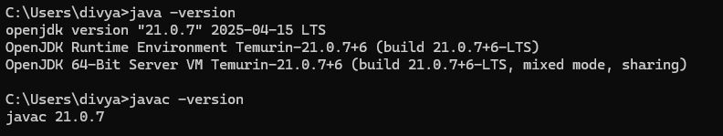
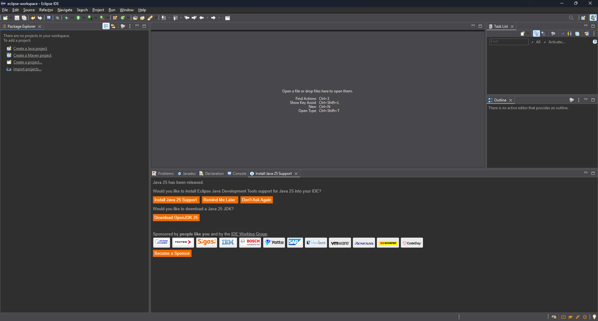
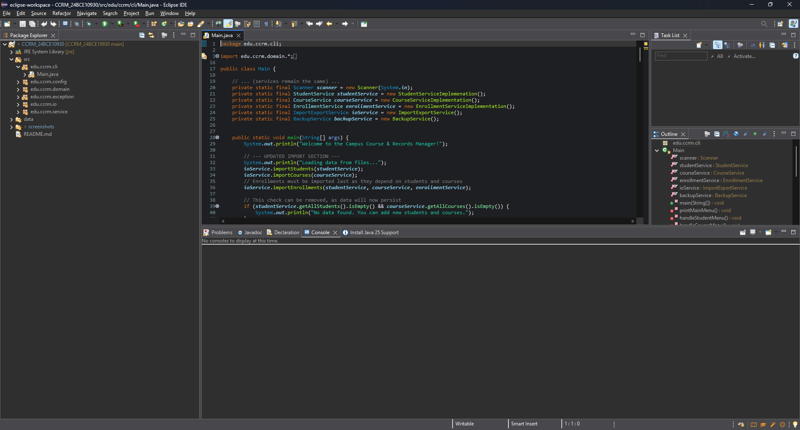
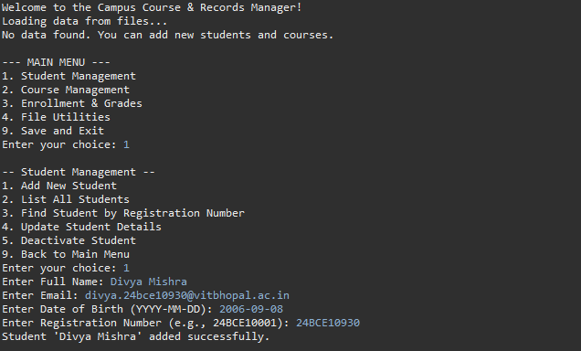

# Campus Course & Records Manager (CCRM)

## Project Overview
The Campus Course & Records Manager (CCRM) is a comprehensive console-based Java application designed to manage student records, course information, enrollments, and academic transcripts for educational institutions. This project demonstrates advanced Java SE concepts including OOP principles, design patterns, file I/O operations, and modern Java features.

## Java Platform Information

### Evolution of Java (Timeline)
- **1995**: Java 1.0 - Initial release by Sun Microsystems
- **1998**: Java 1.2 - Swing GUI, Collections Framework
- **2000**: Java 1.3 - HotSpot JVM, JNDI
- **2002**: Java 1.4 - Assertions, NIO, Regular Expressions
- **2004**: Java 5 - Generics, Annotations, Enums, Autoboxing
- **2006**: Java 6 - Scripting support, Web Services
- **2011**: Java 7 - Diamond operator, Try-with-resources
- **2014**: Java 8 - Lambda expressions, Stream API, Date/Time API
- **2017**: Java 9 - Module system, JShell
- **2018**: Java 10 - Local variable type inference (var)
- **2018**: Java 11 - HTTP Client, String methods (LTS)
- **2019**: Java 12-13 - Switch expressions, Text blocks preview
- **2020**: Java 14-15 - Records preview, Pattern matching
- **2021**: Java 16-17 - Pattern matching, Sealed classes (LTS)
- **2022+**: Java 18+ - Continued evolution with 6-month release cycle

### Java Platform Comparison

| Feature | Java ME (Micro Edition) | Java SE (Standard Edition) | Java EE (Enterprise Edition) |
|---------|-------------------------|----------------------------|-------------------------------|
| **Target** | Mobile/Embedded devices | Desktop/Client applications | Enterprise/Web applications |
| **JVM** | Limited KVM or CDC | Full HotSpot JVM | Full JVM + Application Server |
| **Libraries** | Minimal subset | Complete standard library | SE + Enterprise APIs |
| **Memory** | Very limited (~2-8MB) | Standard (~64MB+) | High memory requirements |
| **Examples** | IoT sensors, old phones | Desktop apps, CLI tools | Web services, EJB applications |
| **Current Status** | Legacy/IoT only | Active development | Evolved to Jakarta EE |

### Java Architecture: JDK, JRE, JVM

#### JVM (Java Virtual Machine)
- **Purpose**: Runtime environment that executes Java bytecode
- **Components**: Class loader, Bytecode verifier, Interpreter/JIT compiler
- **Platform**: Specific to each operating system (Windows, Linux, macOS)

#### JRE (Java Runtime Environment)  
- **Purpose**: Runtime package for running Java applications
- **Includes**: JVM + Core libraries + Supporting files
- **Use case**: End users who only need to run Java applications

#### JDK (Java Development Kit)
- **Purpose**: Complete development environment for Java applications
- **Includes**: JRE + Compiler (javac) + Debugger + Documentation + Tools
- **Use case**: Developers who write, compile, and debug Java code

**Flow**: Source Code (.java) → JDK Compiler → Bytecode (.class) → JVM → Machine Code

## Installation & Setup

### Java Installation on Windows
1. **Download JDK**
   - Visit [Oracle JDK](https://www.oracle.com/java/technologies/downloads/) or [OpenJDK](https://openjdk.java.net/)
   - Download JDK 17+ (LTS recommended)
   
2. **Install JDK**
   - Run the installer with administrator privileges
   - Choose installation directory (e.g., `C:\Program Files\Java\jdk-17`)
   - Complete installation wizard

3. **Set Environment Variables**
   ```cmd
   # Set JAVA_HOME
   JAVA_HOME=C:\Program Files\Java\jdk-17
   
   # Add to PATH
   PATH=%JAVA_HOME%\bin;%PATH%
   ```

4. **Verify Installation**
   ```cmd
   java -version
   javac -version
   ```
   **Screenshot**:  



### Eclipse IDE Setup
1. **Download Eclipse IDE**
   - Visit [Eclipse Downloads](https://www.eclipse.org/downloads/)
   - Choose "Eclipse IDE for Java Developers"

2. **Create New Project**
   - File → New → Java Project
   - Project name: `ccrm-project`
   - Use default location or specify custom path
   - JRE Version: Select installed JDK 17+
   
   **Screenshot**:
   

4. **Configure Run Configuration**
   - Right-click project → Run As → Run Configurations
   - Create new Java Application configuration
   - Main class: `edu.ccrm.cli.Main`
   - VM arguments: `-ea` (enable assertions)
   
   **Screenshot**:
   

## How to Run

### Prerequisites
- Java 17+ installed and configured
- All source files in correct package structure

### Compilation & Execution
```bash
# Navigate to project root
cd ccrm-project

# Compile all Java files
javac -d bin -cp src src/edu/ccrm/**/*.java

# Run with assertions enabled
java -ea -cp bin edu.ccrm.Main
```

### Alternative using IDE
1. Import project into Eclipse/IntelliJ
2. Build project (Ctrl+B in Eclipse)
3. Run Main class with assertions enabled

**Screenshot**: 


## Technical Implementation Mapping

### Syllabus Topic → Implementation Location

| **Java Concept** | **File/Class/Method** | **Description** |
|------------------|----------------------|------------------|
| **OOP - Inheritance** | `Person.java` → `Student.java`, `Instructor.java` | Abstract base class with concrete implementations |
| **OOP - Encapsulation** | All domain classes with private fields + getters/setters | Data hiding with controlled access |
| **OOP - Abstraction** | `Person.java` abstract methods | Abstract class with pure virtual methods |
| **OOP - Polymorphism** | `Person.getDisplayInfo()` overrides | Runtime method dispatch |
| **Design Pattern - Singleton** | `AppConfig.java` | Thread-safe singleton with lazy initialization |
| **Design Pattern - Builder** | `Course.Builder` inner class | Flexible object construction |
| **Interfaces** | `Searchable<T>` interface | Generic interface with default methods |
| **Enums with constructors** | `Grade.java`, `Semester.java` | Enums with fields and methods |
| **Custom Exceptions** | `CustomExceptions.java` | Checked and unchecked exceptions |
| **Lambda Expressions** | `StudentService` filtering methods | Functional programming with predicates |
| **Stream API** | All service classes | Filtering, mapping, collecting operations |
| **NIO.2 File Operations** | `BackupService.java` | Path/Files API with recursive operations |
| **Date/Time API** | `Person.createdAt`, backup timestamps | Modern date/time handling |
| **Recursion** | `BackupService.getDirectorySizeRecursively()` | Recursive directory traversal |
| **Switch Expressions** | `MenuHandler.handleMainMenuChoice()` | Modern switch syntax |
| **Try-with-resources** | `BackupService` file operations | Automatic resource management |
| **Assertions** | Domain class constructors | Runtime invariant checking |
| **Generic Types** | `Searchable<T>`, Collections usage | Type-safe generics |
| **Inner Classes** | `Student.AcademicStatus` | Static nested class |
| **Anonymous Classes** | `StudentService.findStudentsCustom()` | Anonymous Comparator implementation |

## Project Structure

```
ccrm-project/
├── src/
│   └── edu/ccrm/
│       ├── cli/
│       │   └── Main.java                  # Application entry point
│       ├── domain/
│       │   ├── Person.java           # Abstract base class
│       │   ├── Student.java          # Student entity with nested classes
│       │   ├── Instructor.java       # Instructor entity
│       │   ├── Course.java           # Course entity with Builder pattern
│       │   ├── Grade.java            # Grade enum with constructors
│       │   ├── Semester.java         # Semester enum
│       ├── service/
│       │   ├── CourseServiceImplementation.java
│       │   ├── EnrollmentServiceImplementation.java
│       │   ├── StudentServiceImplementation.java         # Generic interface
│       │   ├── StudentService.java   # Student business logic
│       │   ├── CourseService.java    # Course business logic
│       │   └── EnrollmentService.java # Enrollment & Transcript services
│       ├── io/
│       │   └── BackupService.java    # File operations with NIO.2
│       │   ├── ImportExportService.java 
│       └── config/
│           └── DataStore.java        # Singleton configuration
├── data/
│   ├── courses.csv
│   ├── enrollments.csv
│   ├── students.csv
├── screenshots/                      # Required screenshots
└── README.md                         # This file
```

## Key Features Demonstrated

### 1. Object-Oriented Programming
- **Inheritance**: `Person` → `Student`/`Instructor` hierarchy
- **Encapsulation**: Private fields with controlled access methods
- **Abstraction**: Abstract methods in `Person` class
- **Polymorphism**: Runtime method dispatch in `getDisplayInfo()`

### 2. Advanced Java Features
- **Generics**: Type-safe collections and interfaces (`Searchable<T>`)
- **Lambda Expressions**: Functional programming in service classes
- **Stream API**: Data processing and filtering operations
- **Optional**: Null-safe method returns
- **Date/Time API**: Modern temporal handling

### 3. Design Patterns
- **Singleton**: `AppConfig` with thread-safe lazy initialization
- **Builder**: `Course.Builder` for flexible object construction

### 4. Exception Handling
- **Custom Exceptions**: Domain-specific error handling
- **Try-with-resources**: Automatic resource cleanup
- **Multi-catch**: Handling multiple exception types

### 5. File I/O & NIO.2
- **Path/Files API**: Modern file operations
- **Recursive Operations**: Directory traversal and size calculation
- **Stream Processing**: File content manipulation

## Sample Operations

### Main Menu Flow
```
=== CAMPUS COURSE & RECORDS MANAGER ===
1. Student Management
2. Course Management  
3. Enrollment & Grading
4. Reports & Analytics
5. File Operations
6. System Utilities
0. Exit
```

**Screenshot Placeholder**: `screenshots/Menu_StudentAdded.png`

### Menu
1. **Student Management**: Create, list, update and remove students
2. **Course Management**: Create, search for courses
3. **Enrollment & Grades**: Enroll in courses, assign grades, print transcripts
4. **File and Utilities**: Create backup and see backup directory
6. **Save and Exit**: Exit

**Screenshot Placeholder**: `screenshots/Menu_StudentAdded.png`

## Enabling Assertions

Java assertions are used throughout the project for runtime invariant checking:

```bash
# Enable assertions when running
java -ea -cp bin edu.ccrm.Main

# Enable assertions for specific packages
java -ea:edu.ccrm... -cp bin edu.ccrm.Main

# Disable assertions (default)
java -da -cp bin edu.ccrm.Main
```


## Error Handling & Exception Types

### Errors vs Exceptions
- **Errors**: System-level failures (OutOfMemoryError, StackOverflowError)
  - Not recoverable by application
  - Should not be caught in normal application code
  
- **Exceptions**: Application-level issues that can be handled
  - **Checked**: Must be declared or handled (IOException, ClassNotFoundException)
  - **Unchecked**: Runtime exceptions (NullPointerException, IllegalArgumentException)

### Custom Exceptions Used
- `DuplicateEnrollmentException`: Unchecked exception for enrollment conflicts
- `MaxCreditLimitExceededException`: Checked exception for credit validation

## Performance Considerations

- **Stream Operations**: Parallel streams for large datasets in service classes
- **Collections**: Appropriate data structures (HashMap for O(1) lookups)
- **Memory Management**: Defensive copying in immutable classes
- **Resource Management**: Try-with-resources for automatic cleanup

## Future Enhancements

- Database persistence using JDBC
- Web interface using Spring Boot
- REST API endpoints
- Unit testing with JUnit 5
- Logging framework integration
- Configuration externalization

## Acknowledgments

This project demonstrates comprehensive Java SE concepts as specified in the academic curriculum. All code implementations follow Java best practices and coding conventions.

**Note**: This project is for educational purposes and demonstrates various Java language features and design patterns in a cohesive application structure.
